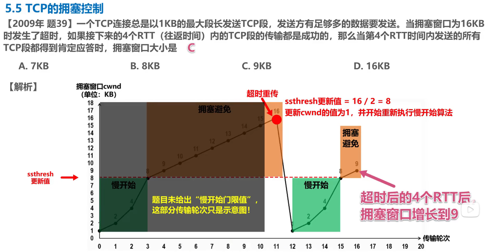

# TCP 的流量控制与拥塞控制


---

## 目录

- 一、流量控制（Flow Control）
- 二、拥塞控制（Congestion Control）
- 三、数值例题
- 四、流量控制 vs 拥塞控制

---

## 一、流量控制（Flow Control）

### 1.1 目的

解决**发送方与接收方处理速度不匹配**的问题：防止发送方发得太快，导致接收方缓冲区来不及处理而丢弃数据。流量控制是**端到端**的，关注的是「**接收方能不能吃得下**」。

### 1.2 核心机制：滑动窗口（Sliding Window）

| 要素 | 说明 |
| --- | --- |
| 通告载体 | TCP 报文首部的**窗口（Window）字段**，即**接收窗口 rwnd** |
| 谁决定大小 | **接收方**根据自己接收缓冲区剩余空间，在 ACK 中通告 rwnd |
| 发送方约束 | 发送方维护**发送窗口**，**发送窗口大小 <= 接收方通告的 rwnd** |
| 滑动方式 | 收到 ACK 后，已确认数据从窗口左侧移出，窗口整体右滑，新数据从右侧进入 |

> 关键点：窗口不是「发完一个、销毁一个、再生成下一个」的离散窗口，而是**同一个窗口不断向前滑动**——左边随确认收缩，右边随新数据扩张。

### 1.3 发送窗口的最终取值

发送方能发多少，不仅看接收方，还要看网络是否扛得住：

```text
发送窗口 = min( rwnd , cwnd )
```

- **rwnd**：接收方说「我吃得下多少」（流量控制）。
- **cwnd**：发送方判断「网络承受得了多少」（拥塞控制，见第二部分）。

### 1.4 零窗口处理与死锁

1. 接收方缓冲区满时，通告 **零窗口（Zero Window）**，发送方暂停发送普通数据。
2. 发送方启动**持续计时器（Persistence Timer）**，超时后发送 **零窗口探测报文（Zero Window Probe）**，探询接收方窗口是否已打开。
3. **死锁风险**：若「窗口已更新的报文」在传输中丢失，双方会互相等待。解决办法是双方各设一个计时器——
   - 发送方：**持续计时器**，定期发零窗口探测报文；
   - 接收方：**窗口更新计时器**，窗口增大时主动（重发）窗口更新报文。
   二者互为兜底，避免永久死锁。

> 一句话：**流量控制 = 接收方告诉发送方「我最多只能接收这么多，你别发太快」。**

---

## 二、拥塞控制（Congestion Control）

### 2.1 目的

防止**过多数据注入网络**导致网络性能下降甚至拥塞崩溃。它由发送方根据 ACK / 丢包情况，动态调整**拥塞窗口 cwnd**。

### 2.2 关键变量

| 变量 | 含义 |
| --- | --- |
| `MSS` | 最大报文段长度（Max Segment Size） |
| `cwnd` | 拥塞窗口，反映发送方估计的网络可承载量 |
| `ssthresh` | 慢开始阈值（Slow Start Threshold），慢开始 / 拥塞避免的切换警戒线 |
| `RTT` | 往返时延（传输轮次） |
| `RTO` | 重传超时时间；超时即认为发生丢包 |

### 2.3 四大算法

#### 1. 慢开始（Slow Start）

- **作用**：连接初期试探性快速探测可用带宽。
- **算法**：`cwnd` 从**初始窗口**（教材常取 1 MSS；现行 RFC 6928 默认初始窗 IW = 10 MSS）开始，**每收到一个 ACK，`cwnd += 1 MSS`**，因此每个 RTT 约翻倍 -> **指数增长**。
- **切换**：当 `cwnd >= ssthresh` 时，转入**拥塞避免**。

#### 2. 拥塞避免（Congestion Avoidance）

- **作用**：接近网络容量时平缓增速，避免引发拥塞。
- **算法**：**加法增大（Additive Increase）**——每个 RTT 仅将 `cwnd += 1 MSS` -> **线性增长**。

#### 3. 快重传（Fast Retransmit）

- **作用**：少量丢包时立即重传，不必等待 `RTO` 超时。
- **触发条件**：发送方连续收到 **3 个重复 ACK**，判定对应报文段丢失，**立即重传**。

#### 4. 快恢复（Fast Recovery）

- **作用**：配合快重传，网络仅轻微拥塞时不把 `cwnd` 砍回 1，从而更快恢复。
- **算法（教材版）**：
  1. `ssthresh = cwnd / 2`；
  2. `cwnd = ssthresh`（**注意不是 1**）；
  3. 直接进入**拥塞避免**线性增长。
- **算法（RFC 5681 标准版）**：进入快恢复时 `cwnd = ssthresh + 3 x MSS`（把已在网络中的 3 个重复 ACK 对应报文计入），之后收到新数据 ACK 后将 `cwnd` 降回 `ssthresh`。两者结论一致：**不重置为 1**。

### 2.4 拥塞发生的两种事件（对比）

| 事件 | 判定严重度 | ssthresh | cwnd 处理 | 进入阶段 |
| --- | --- | --- | --- | --- |
| **超时重传（RTO 超时）** | 严重拥塞 | `cwnd / 2` | `cwnd = 1 MSS`（教材）/ `= 1`（RFC） | 重新**慢开始** |
| **收到 3 个重复 ACK** | 轻微拥塞 | `原 cwnd / 2` | `cwnd = ssthresh`（教材）/ `= ssthresh + 3MSS`（RFC） | **快恢复 -> 拥塞避免** |

### 2.5 核心思想：AIMD

> **加法增大（Additive Increase）、乘法减小（Multiplicative Decrease）**：增长期每 RTT 加 1 MSS（线性），遇拥塞时把 `cwnd` 乘 0.5（砍半）。这是 TCP 拥塞控制收敛且公平的根本原因。

### 2.6 cwnd 随时间变化（锯齿图）

```text
cwnd
  |        /\        /\        超时：回到 1，重新慢开始
  |       /  \      /  \______ 3 个重复 ACK：砍半后快恢复
  |      /    \    /
  |     /      \  /          <- ssthresh（警戒线）
  |    / 指数   \/  线性
  |   /  增长   /\
  |  / 慢开始  /  \ 拥塞避免
  | /________/      \______
  +----------------------------------> time
   1 2 4 8 16  ...   RTT
```


## 三、数值例题

<p align="center">
  
</p>

> 对比可见：超时惩罚远重于「快重传 + 快恢复」。

---

## 四、流量控制 vs 拥塞控制

| 维度 | 流量控制 | 拥塞控制 |
| --- | --- | --- |
| 控制对象 | 接收方处理能力 | 网络链路承载能力 |
| 关键窗口 | 接收窗口 `rwnd` | 拥塞窗口 `cwnd` |
| 信息来源 | 接收方在 ACK 中通告 | 发送方根据 ACK / 丢包自行判断 |
| 目的 | 防止接收方缓冲区溢出 | 防止网络拥塞崩溃 |
| 性质 | 端到端 | 端到端 + 间接反映网络 |

> 记忆口诀：**流量控制看接收方，拥塞控制看网络。**

---
